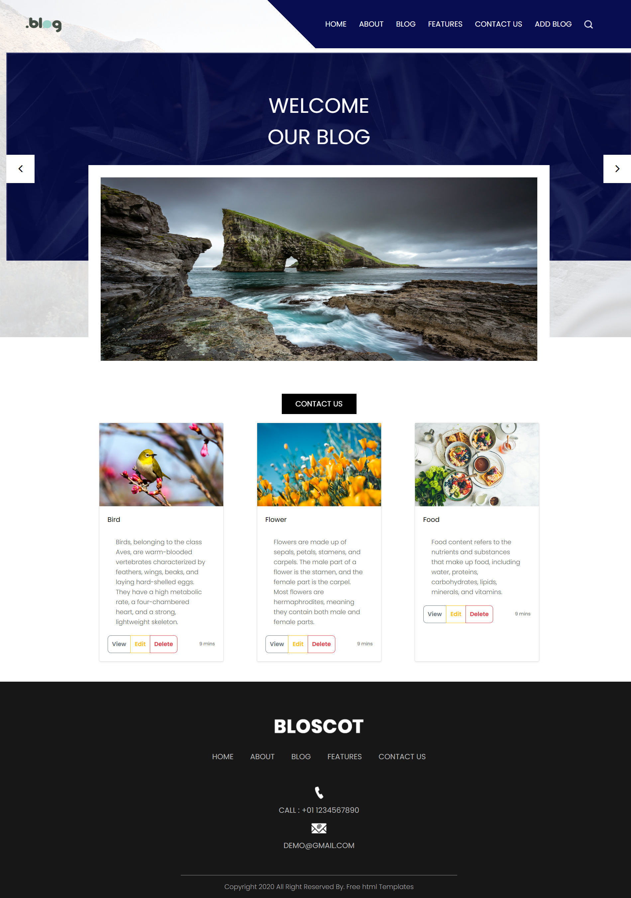
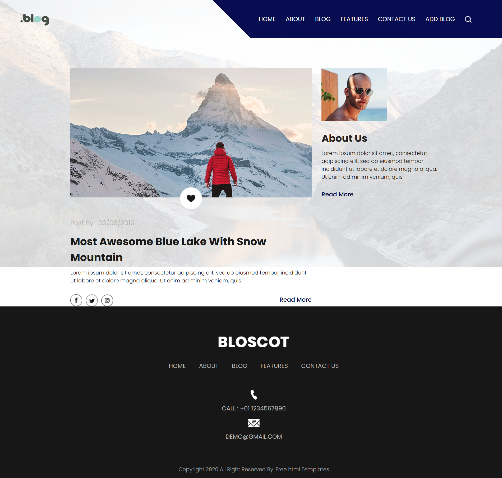
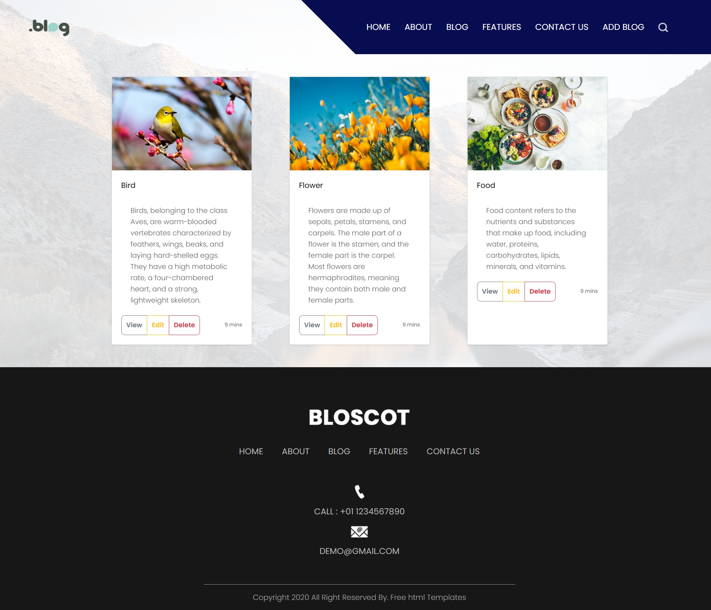
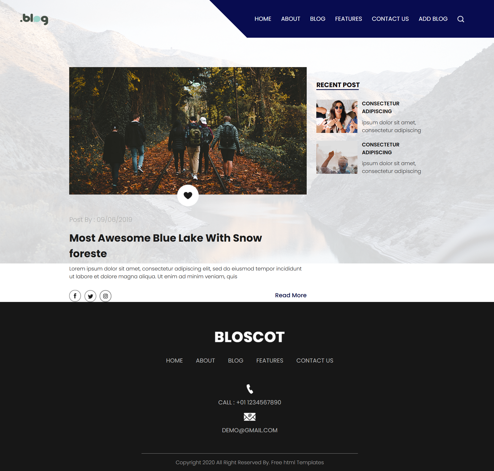
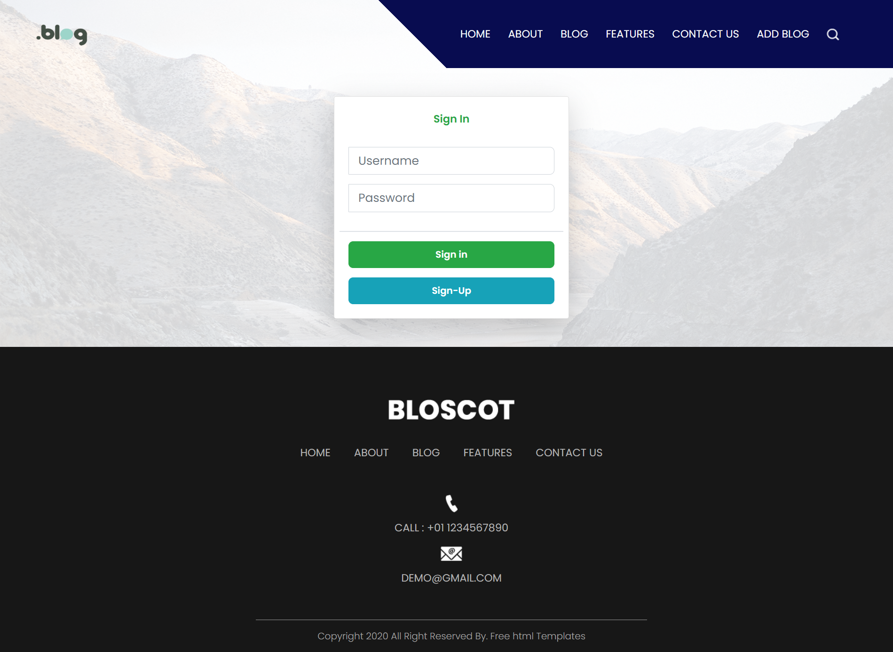
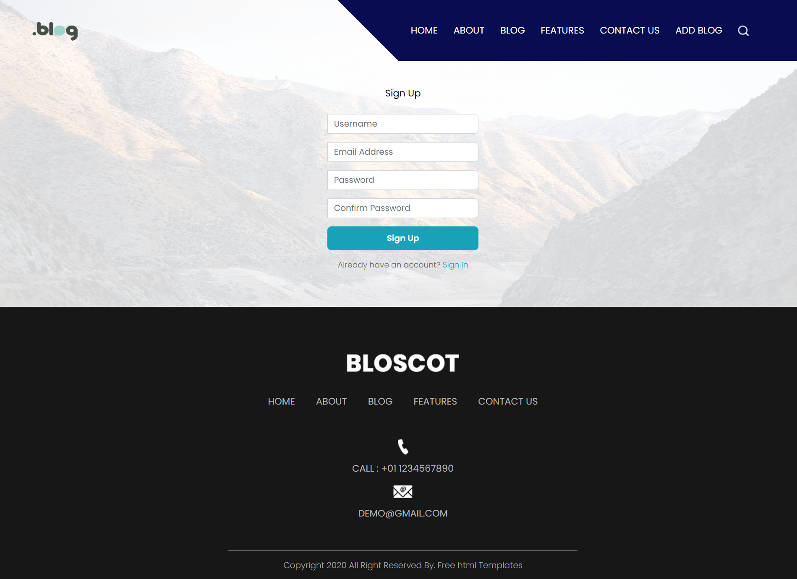
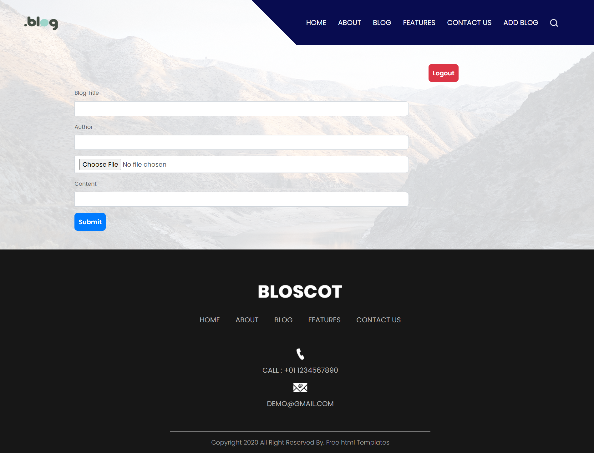

# PR-7-BlogProject
# 📝 BlogProject

A simple **Blog Application** built using **Node.js, Express, MongoDB, and EJS**.  
This project allows users to **create, edit, delete, and view blogs**.

---

## 🚀 Features
✅ User Authentication (Login & Signup)  
✅ Add New Blog Posts  
✅ Edit & Delete Existing Blogs  
✅ View All Blogs  
✅ Upload Images for Blogs  
✅ Responsive UI with Bootstrap  

---

## 🛠️ Technologies Used
- **Node.js** - Backend Framework  
- **Express.js** - Web Framework  
- **MongoDB & Mongoose** - Database  
- **EJS** - Template Engine  
- **Bootstrap** - UI Design  

---

## 📌 Installation

1️⃣ **Clone the repository**  
git clone https://github.com/bhavini1105/PR-7-BlogProject.git

2️⃣ **Install dependencies**
npm install

3️⃣ **Run the project**
node app.js

4️⃣ ** Open in Browser**
Visit http://localhost:3000

🔑 Default Admin Login :

    Username: admin
    Password: 12345
Use these credentials to log in as an Admin.

📷 Screenshots :

1️⃣ Home Page:
 

2️⃣About Page :

3️⃣Blog Page :

4️⃣ Features Page :

5️⃣ Contact Page :

6️⃣ Signin Page :

7️⃣ SignUp Page :

8️⃣ Addblog Page :
